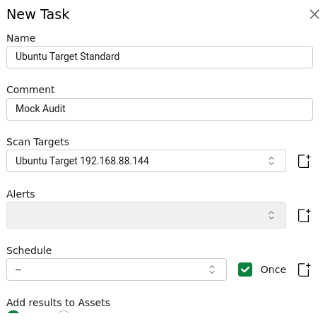
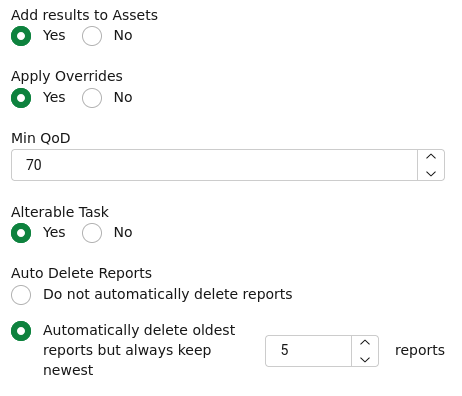
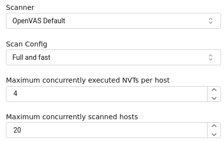
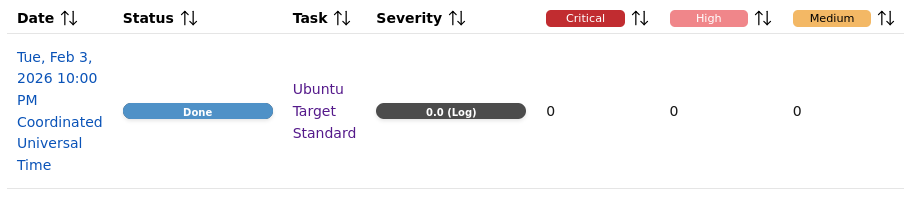
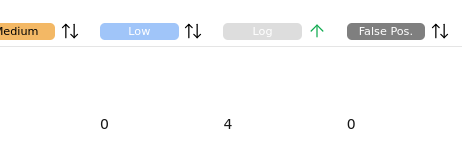
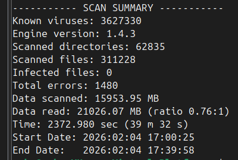
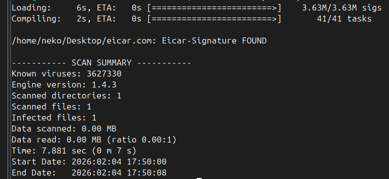
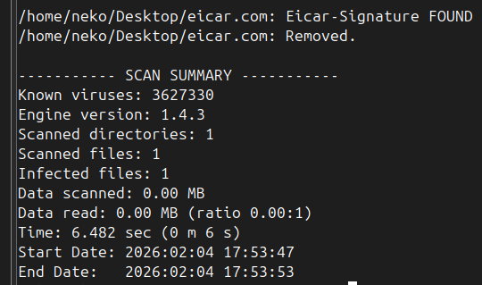

### 2026-01-26 - Single-Endpoint Cybersecurity Audit
##### Cybersecurity Portfolio Project - Conducted by Neko Free

## Executive Summary
This project demonstrates identifying potential vulnerabilities and implementing appropriate security hardening measures on an Ubuntu Linux workstation. Tools such as Nmap, Lynis, and OpenVAS / GVM are used to discover potential vulnerabilities, misconfigurations, and unused ports/services from the perspectives of both a defender and a malicious insider on the local network.

Using the Lynis security auditing tool from the defender perspective to compare against a pre-remediation baseline, The table below indicates that 8 suggestions have been addressed & the hardening index has improved by 8 points.
**A hardening index of 80 is considered fairly secure.**

| **Stage**    | **Suggestions Count** | **Hardening Index** |
| ------------ | --------------------- | ------------------- |
| Before Audit | 40                    | 65                  |
| After Audit  | 32                    | 73                  |

# Table of Contents
1. **Project Overview**
2. **Objectives**
3. **Scope & Tools**
4. **Identify Assets - *PROJECT START***
5. **Identify Vulnerabilities, Assess Security Posture**
6. **Assess Risks**
7. **Create & Execute Remediation Plan, Validate Steps - *PROJECT END***
8. **Final Report**

## 1 - Project Overview

This project simulates a mock cybersecurity audit of an Ubuntu Linux **VM** (**Virtual Machine**) workstation, focused primarily on endpoint-specific vulnerability scanning and remediation.

In this **controlled lab environment**, a Kali Linux VM will simulate a rogue insider or threat actor who, having previously gained access to the local network, is now able to attempt lateral movement. Due to the technical constraints of the lab environment, the scope of this project will only address the security of a specific endpoint within the network.

Vulnerability scanning will be performed from the perspectives of both Ubuntu Linux (Target / Defender) and Kali Linux (Attacker) to gain a more-comprehensive understanding of the ubuntu workstation's attack surface.

Additional project documentation in forms such as spreadsheets can be found in the "documentation" folder.

## 2 - Objectives

#### 1 - Identify Assets:
Catalog assets relevant to the audit. In this small-scope example, this catalog consists of a workstation, an employee, and fictional sensitive data stored on the workstation. Due to the sensitive data residing on the workstation & the absence of potential for social engineering techniques, the workstation will be the sole security focus of this project.

#### 2 - Identify Vulnerabilities
Use available tools to identify vulnerable configurations, ports, and services from attacker and defender perspectives. Store a catalog of any vulnerabilities discovered in the documentation folder.

#### 3 - Assess Risks
Assign risk scores to vulnerabilities, calculated as likelihood multiplied by impact. Use risk scores to prioritize remediation steps.

#### 4 - Create & Execute Remediation Plan
Create a remediation plan to harden security against the identified vulnerabilities prioritized based on their risk scores. Execute the plan. Document steps taken; rationale; and end results.

## 3 - Scope & Tools

The scope of this project is: **identifying potential vulnerabilities in an ubuntu workstation's configuration, ports, & services**.

With the goal being endpoint-based security hardening, Non-endpoint network security & inline network appliances such as hardware firewalls and **intrusion prevention systems** (**IPS**) are beyond the scope of this demonstration.

The fictional data in this project serves as a simple "lose condition". It is not comprehensively simulated with a database, encryption, hashing/salting, or transmission. This project also assumes that, for the sake of simplicity, the fictional organization this audit is being performed for is already in regulatory compliance. Therefore, compliance testing is beyond this project's scope.

This project will utilize 2 VMs hosted using **VMWare Workstation** Hypervisor Software, as well as **Command Line Interface** (**CLI**) & **Graphical-User Interface** (**GUI**)-based auditing tools.

| Tool          | Type    | Purpose                                    | Perspective |
| ------------- | ------- | ------------------------------------------ | ----------- |
| Ubuntu Linux  | OS & VM | Subject of Security Audit                  | Defender    |
| Kali Linux    | OS & VM | Vulnerability Scanning                     | Attacker    |
| Nmap          | CLI     | Network Discovery & Vulnerability Scanning | Both        |
| Lynis         | CLI     | Security Auditing                          | Defender    |
| GVM / OpenVAS | WebUI   | Vulnerability Scanner                      | Attacker    |

## 4 - Identify Assets

| **Item**                            | **Description**             |
| ----------------------------------- | --------------------------- |
| Ubuntu VM                           | Mock Workstation            |
| */do-not/steal/super-sensitive.txt* | Mock Sensitive Data         |
| Me                                  | Security Auditor / Employee |

## 5 - Identify Vulnerabilities, Assess Security Posture

#### Defender Side - Lynis - Assessing security posture

Following execution of `sudo lynis audit system`, Lynis assigned the system a hardening index of 65. This is a score between 0 and 100 representing the overall security posture of the system. A score of 80 is generally considered well-hardened. With a score of 65, the system has been hardened somewhat, but needs more work.

In the command's output, 0 warnings and 40 suggestions are present. Below, I will list a subset of these that I believe will be the most relevant to improving this system's security posture in the upcoming remediation plan.

| ID        | Suggestion                                                                                                                       |
| :-------- | -------------------------------------------------------------------------------------------------------------------------------- |
| DEB-0810  | Install apt-listbugs to display a list of critical bugs prior to each APT installation.                                       |
| DEB-0811  | Install apt-listchanges to display any significant changes prior to any upgrade via APT.                                      |
| DEB-0831  | Install needrestart to determine which services are still running old versions of libraries after upgrades & need restarting. |
| DEB-0880  | Install fail2ban to automatically ban hosts that commit multiple authentication errors.                                       |
| BOOT-5112 | Set a password on GRUB boot loader to prevent altering boot configuration.                                                    |
| HRDN-7230 | Install at least one malware scanner to perform periodic system scans.                                                        |
| KRNL-5820 | Disable unnecessary core dumping to limit potential exfil of sensitive data                                                   |
| AUTH-9328 | Set default umask in /etc/login.defs to 027                                                                                      |
| USB-1000  | Disable USB storage drivers when not used, to prevent data theft or unauthorized storage                                      |
| PKGS-7370 | Install debsums utility for the verification of packages with known and trustworthy databases                                 |
| PRNT-2707 | CUPS configuration file access permissions should be more strict                                                                 |
These suggestions have been documented in the **remediation-steps-lynis.odt** spreadsheet in the documentation folder.

#### Defender Side - Nmap - Discover Vulnerable/Unused Ports & Services

###### Breaking Down the Commands Used (Defender Side)

###### TCP Port Scanning
`nmap -T4 -p- 192.168.88.144`
- Execute a high-speed scan (-T4) on all ports (-p-) for local IP 192.168.88.144 (Defender's local IP).
- Due to having an IP explicitly specified, This traffic went out through a network interface and came back, and was treated as external traffic.
**Executing this command did not find any open ports.**

`nmap -T4 -p- localhost`
- Execute the same type of scan without interacting with a network interface
- Using localhost (loopback) is a machine talking directly with itself, which avoids sending its traffic through an interface. This is treated as internal traffic.
**Executing this command found 1 open port: 631 (IPP / Internet Printing Protocol).

`sudo ss -tlnp | grep 631`
- As super user, run (sudo) ss (Socket Statistics) with the following options: Only show TCP sockets (-t), listening sockets (-l), numeric output (-n), and process information (-p).
- Pipe into grep command to focus on lines relevant to port 631 (IPP).
**The output of this command indicates that TCP socket 631 is only listening for localhost traffic, ignoring external traffic. This explains the discrepancy between the two Nmap commands previously executed.
It is also indicated that socket 631 is used by the CUPS (Common Unix Printing System) service.**

Based on these findings, It's concluded that the only open TCP port (631 / IPP) is only available on the local machine, and does not present any security vulnerabilities.
Nevertheless, The cups service is currently not in use, and will be disabled during remediation.

###### UDP Port Scanning

`nmap -T4 -p- -sU 192.168.88.144`
- As super user, run Nmap at speed T4 and perform UDP scan (-sU) on all ports for the defender's local IP.
- This will be treated as external traffic.
**Executing this command found 2 open|filtered UDP ports: 5353 & 38019.**

`sudo ss -lnp | egrep "5353|38019"`
- As super user, run ss. Only show listening sockets, numeric output, and process information. The option -t is omitted this time, so this will include UDP sockets.
- Pipe into egrep command to focus on lines relevant to ports 5353 & 38019. egrep is the equivalent of running grep with the -e option, which allows regular expressions to be used in patterns. The "pipe" symbol indicates an "OR" condition.
**Executing this command indicates that UDP sockets 5353 & 38019 listen on ports 5353 & 38019 on all addresses, and are used by the avahi-daemon service, which is used for mDNS (Multicast DNS) & local network service discovery.

The avahi-daemon service is currently not in use, and will be disabled during remediation.

#### Attacker Side - Nmap - Discover Vulnerable/Unused Ports & Services

Switching over to the attacker's perspective, We can try similar Nmap scans to those used previously to see if they align with defender-side observations.
###### Breaking Down the Commands Used (Attacker Side)

###### Verifying that attacker (192.168.88.143) can reach the defender
`ping -c 3 192.168.88.144`
**This command indicates the machines can communicate, so Nmap tests can proceed!**

###### TCP Port Scanning
`nmap -T4 -sT -v -p- 192.168.88.144`
- Perform a high-speed TCP Connect scan on all ports in verbose mode
**No open ports found.**

###### UDP Port Scanning
`nmap -T4 -sU -v -p- 192.168.88.144`
- Perform a high-speed UDP scan on all ports in verbose mode
**No open ports found.**

Nmap was unable to discover any open TCP or UDP ports.

Additional attacker-side and defender-side port scanning was performed in IPv6 mode, resulting in the same outputs as those from the IPv4 scans.

#### Attacker Side - GVM / OpenVAS - Vulnerability Scanning
#### GVM WebUI

###### Creating & Executing a New Task
After fully installing and setting up GVM, I created a new task to scan the target machine for vulnerabilities. Most settings for this task were left at their default values.

###### Report Assessment
Upon completion of the vulnerability scanning task, GVM's report indicates that **no vulnerabilities have been detected.**

## 6 - Assess Risks

With no immediate vulnerabilities identified, The objective of this audit will shift solely to improving the overall security posture of the workstation based on the findings from Lynis & Nmap.

To start, For each item in the documentation/remediation-steps-lynis.odt spreadsheet, I will calculate the risk of the item introducing a future vulnerability, calculated as likelihood multiplied by impact. The rationale behind the risk calculations will also be provided where appliable in a new column.

## 7 - Create, Execute, & Validate Remediation Plan

Each suggestion provided by Lynis will be addressed with appropriate security hardening & subsequent validation steps to ensure adequate action has been taken.

The hardening & validation will be combined to streamline this process by providing immediate and granular feedback.

In addition, 2 unused services will be stopped and disabled.

### AUTH-9328 - Set default umask to 027

###### Baseline
To establish a baseline, I will examine the contents of `/etc/login.defs` and execute the `umask` command, afterward examining the permissions of a newly-created example file.

`cat /etc/login.defs | grep -i umask`
Using cat & grep to search the contents of /etc/login.defs for case-insensitive instances of **umask** indicates that the default umask is `022` `(rw-r--r–-)`.

However, The `umask` command indicates that the current umask `0002` `(rw-rw-r–-)`.

Creating an example.txt file in the main user's home directory without elevated access results in a file with permissions `rw-rw-r--`, reflecting the output of the umask command.

The discrepancy between the default umask setting and the current umask indicated by the `umask` command is likely a result of the `USERGROUPS_ENAB` variable being set to `yes` in `/etc/login.defs`. To test this hypothesis, I will change `USERGROUPS_ENAB`'s value to `no`; reboot the system; and check the current umask again.

`[modify variable in nano]`
`sudo reboot`
`umask` -> `022`
With the hypothesis confirmed, I now have a pathway to changing the default umask.

###### Why 027?

| UMask | Permissions | Explanation                                               |
| ----- | ----------- | --------------------------------------------------------- |
| 0002  | rw-rw-r--   | Owner & group can read & write the file. Others can read. |
| 022   | rw-r--r--   | Owner can read & write the file. Group & others can read. |
| 027   | rw-r-----   | Owner can read & write the file. Group can read.          |
In this table, we can see that using 027 as the default umask prevents users who are neither the file's owner nor within the file owner's group from accessing the file in any capacity. It also ensures that the file is unable to be tampered with by others in the file owner's group.

Using umask 027 improves data integrity by ensuring only a file's owner can write to it, and improves data confidentiality by ensuring only appropriate users & group members on a system are able to view the content of the file.

###### Remediation & Validation

I will start remediation by simply opening nano and changing the `UMASK` variable's value in `/etc/login.defs` to `027`. To validate this remediation, I will run `umask` to determine the current umask and create an `example.txt` file & examine its permissions with `ls -la`.

`[modify variable in nano]`
`sudo reboot`
`umask` -> `027`
`touch example.txt` -> create example.txt in user home dir
`ls -la` -> display all files & their permissions in directory

example.txt's permissions are now `rw-r-----`: exactly what is expected from umask 027!

### BOOT-5112 - Set password on GRUB Boot Loader

To set a new password on the bootloader, I will first run `grub-mkpasswd-pbkdf2` and enter the desired password twice to generate a password hash using the pbkdf2 hashing algorithm.

Then, I will edit the grub configuration at `/etc/grub.d/40_custom` using nano to include lines similar to the following:
set superusers="insert_username_here"
password_pbkdf2 insert_username_here insert_password_hash_here

Lastly, I will apply the changes and reboot the system to validate hardening effectiveness.
`sudo update-grub`
`sudo reboot`
**Confirmed: A password is now required to access the boot loader!**

#### HRDN-7230 - Install a malware scanner
###### Remediation
After some online research, I selected **ClamAV** as the malware scanner for this remediation.
To begin, I will install ClamAV and the ClamAV daemon through the apt package manager:

| `sudo apt update`                | Fetch up-to-date list of package versions |
| -------------------------------- | ----------------------------------------- |
| `sudo apt install clamav`        | Install ClamAV                            |
| `sudo apt install clamav-daemon` | Install ClamAV Daemon                     |
Next, To establish a baseline, I will try performing a recursive scan starting at the root directory:
`sudo clamscan -r /`

Good! No infected files identified.

Continuing setup, I will start and enable clamav-daemon so it can run in the background.
`sudo systemctl start clamav-daemon`
`sudo systemctl enable clamav-daemon`
`sudo systemctl status clamav-daemon`

###### Validation
Due to security concerns and limitations in my security home lab setup, I am unable to safely test the malware scanner on actual malware. However, It is possible to create "antivirus test files" which scan as viruses.

`touch ~/Desktop/eicar.com` -> Step 1
**set contents to** `X5O!P%@AP[4\PZX54(P^)7CC)7}$EICAR-STANDARD-ANTIVIRUS-TEST-FILE!$H+H*` -> Step 2
`clamscan -r ~/Desktop` -> Scan the antivirus test file

Excellent! The test file was detected as an infected file.
I'll try the scan again, this time using the --remove option to remove the file on sight:
`clamscan -r --remove ~/Desktop`

#### PRNT-2707 - Make CUPS Configuration File permissions stricter
###### Finding the CUPS Configuration File
`sudo find / -iname cupsd.conf` -> `/etc/cups/cupsd.conf`
Search for files with the name `cupsd.conf` starting at the root directory.

###### Checking current permissions
`cd /etc/cups` -> Navigate to directory containing cups configuration file

`ls -la cupsd.conf` -> Display permissions of cups configuration file
`-rw-r--r--   1 root root  6795 Aug  5  2025 cupsd.conf`

###### Remediation & Validation
Currently,  All system users are able to read the file. **PRNT-2707** specifies that normal users should not be able to read the file.

`sudo chmod o-r cupsd.conf` -> Subtract read permission from "other" group for cfg file

`ls -la cupsd.conf` -> Display new permissions
`-rw-r----- 1 root root 6795 Aug  5  2025 cupsd.conf` -> looks good!

`sudo lynis audit system | grep -i cups` -> **PRNT-2707** no longer appears in suggestions of lynis system audits. Looks good!

#### USB-1000 - Disable USB Storage Drivers

##### Establishing a baseline
`lsmod | grep usb_storage` - Check to see if the usb_storage driver is in use
**No output. - Not in use**

`modinfo usb_storage | egrep "name|description"` -> Check to see if usb_storage driver exists
**Driver exists.**

The driver is not currently in use, but is available. I'll test whether it is usable by plugging a USB storage device into the VM.
`[USB storage device plugged into VM]`
**New volume appears in output of df command**
`lsmod | grep usb_storage` **now returns a driver**

###### Remediation
Online research indicates that the correct course of action to implement Lynis's **USB-1000** suggestion is to navigate to /etc/modprobe.d/ and create a blacklist file for the usb_storage driver.

`cd /etc/modprobe.d/` -> Go to directory with driver blacklist files
`sudo nano blacklist-usb-storage.conf` -> Create a usb-storage blacklist file
Populate file with `blacklist usb-storage` and an appropriate comment, Save file

`update-initramfs -u` -> Update the initial ram file system to ensure the usb-storage driver blacklist takes effect

`sudo reboot` -> Reboot the system
###### Validation
`[Attempt to plug a USB storage device into the VM]`
**New volume appears in output of df command**
`lsmod | grep usb_storage` **returns uas driver???**

###### Remediation - 2nd Attempt
`cd /etc/modprobe.d/` -> Return to driver blacklist directory
`sudo nano blacklist-usb-storage.conf` -> Edit usb-storage blacklist file
Add line `blacklist uas`, Save file
`sudo update-initramfs -u` -> Update initial ram file system again
`sudo reboot` -> Reboot the system again

###### Validation - 2nd Attempt
`[Attempt to plug a USB storage device into the VM]`
**Device failed to connect to the VM. Success!**
`lsmod | grep usb_storage` -> Check to see if the usb_storage driver is in use. (**It is not.**)

For good measure, I will repeat the lynis system audit to see if the **USB-1000** suggestion still comes up:
`sudo lynis audit system | grep -i usb`
**USB-1000 suggestion no longer appears!**

#### DEB-0880 - Install fail2ban service
`sudo apt install fail2ban` -> Install fail2ban
`sudo systemctl start fail2ban` -> Start fail2ban service
`sudo systemctl enable fail2ban` -> Create symlink for fail2ban for automatic startup
`sudo systemctl status fail2ban` -> Verify that fail2ban is now running and enabled

#### KRNL-5820 - Disable core dumping
###### Remediation
###### Modify /etc/security/limits.conf file to disable core dumping
`cd /etc/security/`
`sudo nano limits.conf`
Add lines `* hard core 0` and `root hard core 0` to set core file size to 0
###### Validation
Check to see if **KRNL-5820** suggestion still comes up in lynis system audits:
`sudo lynis audit system | grep -i core`
**KRNL-5820 suggestion no longer appears!** 

#### DEB-0831 - Install needrestart to help avoid running outdated libraries
`sudo apt install apt-needrestart` -> Install needrestart
`needrestart` -> Check to see that needrestart installed correctly

#### DEB-0810 - Install apt-listbugs
Package unavailable on ubuntu, Marking as "not applicable".

#### DEB-0811 - Install apt-listchanges
`sudo apt install apt-listchanges` -> Install apt-listchanges
`apt-listchanges` Check to see that apt-listchanges installed correctly

#### PKGS-7370 - Install debsums utility to verify integrity of packages
`sudo apt install debsums` -> Install debsums
`apt download firefox` -> Download the firefox package to the main user's home dir
`debsums firefox_1%3a1snap1-0ubuntu5_amd64.deb` -> Verify package checksums
`rm firefox_1%3a1snap1-0ubuntu5_amd64.deb` -> Delete package after concluding test

#### Stopping & Disabling Unused Services
During Nmap port scanning & a Lynis system audit, 2 unused services were discovered: `cups`, and `avahi-daemon`. These 2 services will be disabled to help reduce the system's attack surface area.

`sudo systemctl status cups`
`sudo systemctl status avahi-daemon`
**Both services are active and enabled.**

`sudo systemctl disable cups avahi-daemon avahi-daemon.socket`
`sudo systemctl stop cups avahi-daemon avahi-daemon.socket`
**Attempt to stop both services**

`systemctl status cups`
`systemctl status avahi-daemon`
`systemctl status avahi-daemon.socket`
**All services down!**

**Check to see if services come back up after rebooting**
`sudo reboot`

`systemctl status cups`
**Cups service is running? What's going on here?*

`systemctl is-enabled cups avahi-daemon avahi-daemon-socket`
**disabled disabled disabled**

The services are starting automatically on boot despite being disabled. According to some online research, you can use a command to "mask" the services by giving them symlinks that point to /dev/null.
`sudo systemctl mask cups avahi-daemon avahi-daemon-socket`
`sudo reboot`

`systemctl status cups avahi-daemon avahi-daemon.socket`
**All services down!**

## 8 - Final Report

### Findings
###### Nmap Port Scanning - Both Perspectives
- Defender-side Nmap findings indicated that only 1 TCP port (631 / IPP), used by the cups service was open to localhost, with no ports open to external traffic. 2 UDP ports (5353 & 38019) related to the avahi-daemon service were open to external traffic.
- Attacker-side Nmap findings found no open ports.
- Identified the unused services "cups" and "avahi-daemon"
###### Lynis System Audit - Defender Perspective
- Warnings: 0
- Suggestions: 40
- Hardening index: 65
- Identified missing access controls, antivirus software & security utilities
- Identified potential data exfil vectors / several misconfigurations 
###### OpenVAS / GVM - Attacker Perspective
- No vulnerabilities identified.

### Improvements to Ubuntu Workstation's Security Posture

###### Security hardening tasks performed
1. Default UMask changed to 27, improving data confidentiality & integrity
2. Password set on GRUB Bootloader to prevent system configuration tampering
3. ClamAV Malware Scanner installed to detect and remove malicious files
4. CUPS config can no longer be read by normal users
5. USB storage drivers disabled to help limit unauthorized data exfil
6. Installed fail2ban to automatically ban hosts after multiple failed authentications
7. Core dumps disabled to help limit unauthorized exfil of sensitive data
8. Installed needrestart to prevent outdated libraries from continuing to run
9. Installed debsums utility to verify integrity of downloaded packages
10. Installed apt-listchanges to indicate significant changes prior to APT upgrades
11. Unused services cups & avahi-daemon have been disabled.

###### Comparing against pre-remediation hardening index
The table below is a result of performing another lynis system audit and comparing against the results from an audit performed pre-remediation. It indicates a substantial hardening index improvement of 8 points & 8 suggestions having been addressed.

| **Stage**    | **Suggestions Count** | **Hardening Index** |
| ------------ | --------------------- | ------------------- |
| Before Audit | 40                    | 65                  |
| After Audit  | 32                    | 73                  |

### Conclusion
- Disabled unused services identified by Nmap & ss
- Performed security hardening & validation steps based on suggestions proposed by the Lynis security auditing tool
- Performed vulnerability scanning using OpenVAS / GVM (No vulnerabilities detected)
- Improved security hardening index to 73 (+8 points)

Despite the security hardening measures taken resulting in a substantial improvement in security posture, additional auditing and a comprehensive review of the endpoint firewall rules will likely be necessary to gain a more-comprehensive understanding of the workstation's attack surface.

Currently, due to being a freshly set up machine, the ubuntu workstation has minimal vulnerabilities, but is likely to accrue vulnerabilities as the complexity of its work & software environment increases. As such, Periodic auditing should be performed as the environment changes to stay current on necessary security hardening and controls.

# TESTING - Github formatting

# 1
## 2
### 3
#### 4
##### 5
###### 6

`Code Block 1 line away`
`Code Block 1 line away`

`Code Block 2 lines away`

`Code Block 2 lines away`

