# SIEM Setup & Usage
### Portfolio project conducted on 2026/02/10 by Neko Free

### Table of Contents
- **1 - Project Overview**
- **2 - Splunk Cloud - Querying, Dashboards, & Data Analysis**
- **3 - Wazuh - Data Aggregation, Alert Triggering & Monitoring, Custom Rules**
- **4 - Conclusion**

---

## 1 - Project Overview
### Objective

The aim of this project is to demonstrate an adequate level of proficiency with industry-standard SIEM tools such as **Splunk Cloud** and **Wazuh**.

### Tools, Software, & Data Used

| Tool                    | Type       | Purpose                                                                 |
| ----------------------- | ---------- | ----------------------------------------------------------------------- |
| Windows 11              | Main OS    | Personal computer, Host for VMWare Workstation                          |
| VMWare Workstation      | Hypervisor | Host for various VMs (Virtual Machines)                                 |
| Ubuntu Linux            | VM         | Defender Perspective; Endpoint for Wazuh agent                          |
| Amazon Linux 2023       | VM         | Host for Wazuh web server                                               |
| **Splunk Cloud**        | **SIEM**   | Querying, Data Visualization, Dashboards, Data Analysis                 |
| **Wazuh**               | **SIEM**   | Data Aggregation, Alert Triggering & Monitoring                         |
| Buttercup Games Dataset | Dataset    | Fictitious dataset used for data analysis demonstration on Splunk Cloud |

### Limitations & Scope
I will not be aggregating data from on-premise VM logs to CSPs (Cloud Service Providers), instead opting to aggregate data locally to Wazuh. As such, this project will be broken down into 2 main sections exploring different aspects of SIEM tools:

The first section (for **Splunk Cloud**) will focus on querying, visualization, dashboard creation, & data analysis for a fictitious dataset.

The second section (for a locally-hosted **Wazuh** web server) will focus more on data aggregation, alert triggering and monitoring, custom rules, and more-realistic use cases.

---

## 2 - Splunk Cloud - Querying, Dashboards, & Data Analysis

### Importing the Buttercup Games Dataset
To begin, I downloaded the fictional Buttercup Games dataset from the [Splunk documentation site](https://docs.splunk.com/Documentation/SBF/-Latest-/Tutorial/Uploadthetutorialdata). 

Next, In the Splunk Cloud WebUI, I navigated to the "Add Data" section and entered the following to import the dataset:

| Setting     | Value                       |
| ----------- | --------------------------- |
| Source      | Downloaded Dataset ZIP File |
| Source Type | Automatic                   |
| Host        | Constant Value              |
| Index       | Default                     |

### Querying

With the dataset imported, I can now begin running queries and creating visualizations & dashboards. I'll start by querying the status of recent orders:

`source="Game_store.zip:./game_store/order.txt"`

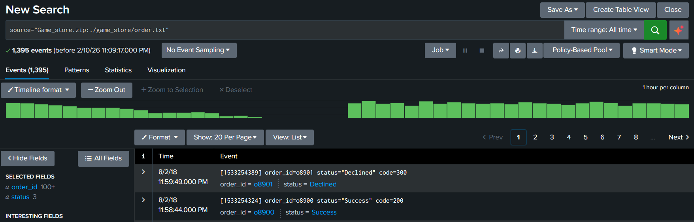

Looks good! Now, I'll create a line chart visualization of the orders, plotting time against status counts:

`source="Game_store.zip:./game_store/order.txt" | timechart count by status`

**Switched to Visualization tab**
### Setting up a data visualization

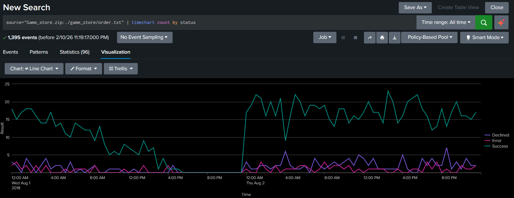

This visualization helps provide insight into current business operations, and can assist in identifying periods of downtime & potential DoS (Denial of Service) attacks.

Due to the relatively small size of this project's dataset, order data is only available for 2 days in August of 2018. In real world conditions, such data would be significantly larger in quantity, and would be continuously generated & parsed into a live feed.

### Creating a new dashboard

Next, I will save this panel to a new dashboard with the aim of centralizing data visualizations relevant to the status of current business operations. This example is not strictly speaking security-related, although some security-related insights can be inferred from the data such as whether a DoS attack is taking place.

Regardless, the same data visualization principles can easily be reused for security-specific data streams.

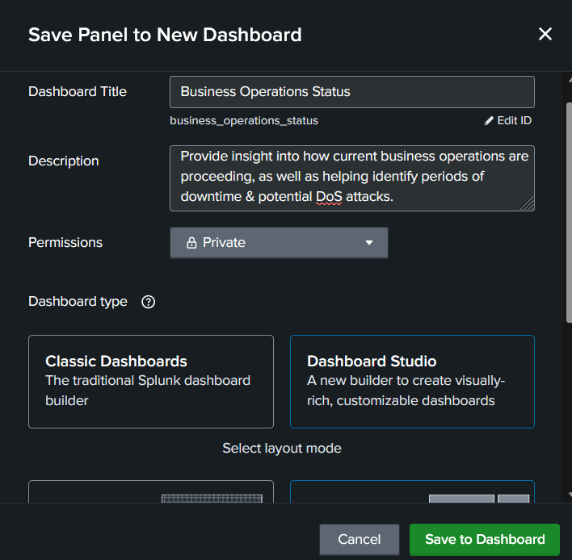
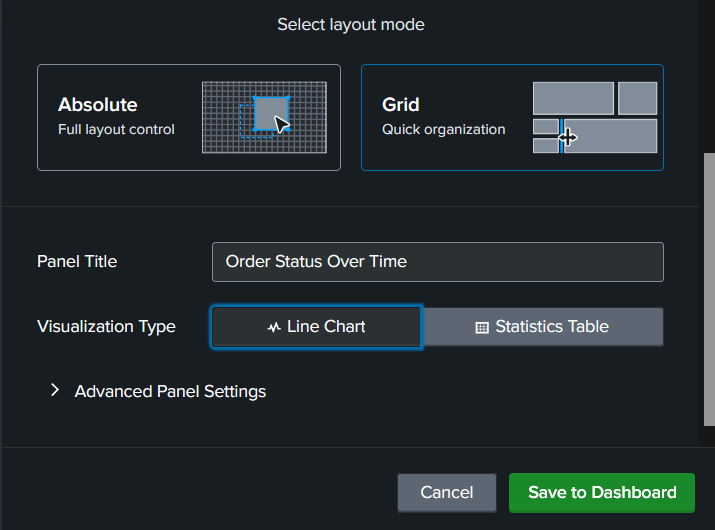

This new dashboard will use the "Dashboard Studio" type & the "Grid" layout mode for flexibility and easy customization.

Let's see how it turns out:

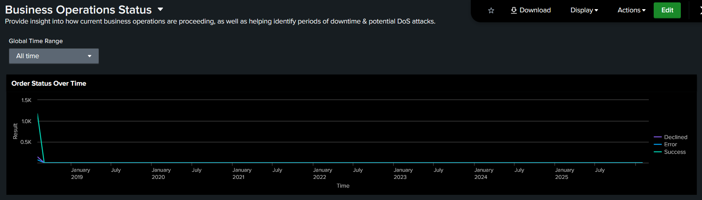

This doesn't seem right. The dataset only includes order data for a couple of days in 2018, but the panel is displaying the sum of orders for each month over several years. For this panel to be useful, we'll need to somehow zero in only on the latest relevant data. The data should also be broken up into roughly 30-minute "bins" rather than month-long bins for more granularity.

Adding the `span=30m` option to the query seems to have solved both problems. 

`source="Game_store.zip:./game_store/order.txt" | timechart span=30m count by status`

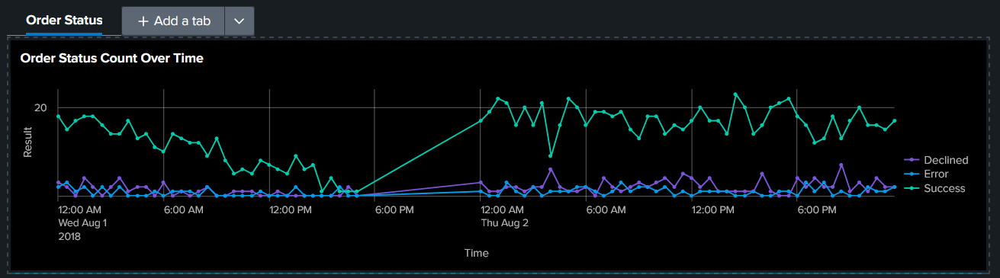

However, The gap previously seen in the visualization is now being linearly interpolated between instead of being empty. I feel that this misrepresents the data, and needs to be addressed.

I have tried adding `cont=true` and `cont=false` to the query, as well as trying "Gaps", "Zero", and "Connect" settings under the **null value display** section, but none of this has restored the gap.

Removing the `span=30m` bin option from the query and manually selecting a timespan was able to restore the gap, but that brings us back to the first issue.

...As a stopgap measure, I'm just going to switch the visualization to a stacked column chart and call it a day. That will solve the interpolation issue in exchange for a minor decrease in visual clarity.

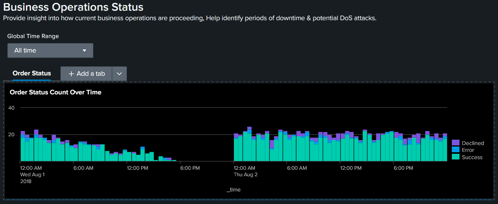

### Finishing the Business Operations Dashboard

I will repeat the previously used process of querying and visualizing data into panels to fill out the rest of this dashboard. Information from the visualization panels can easily be cross-referenced with one-another at a glance to infer deeper insights.

I cleaned up the existing order status query, and created new queries & visualizations for call center & web store activity. The new visualization panels are now part of the dashboard.

`sourcetype="order" | timechart span=30m fixedrange=true count by status`

`sourcetype="call_center" | timechart span=30m fixedrange=true count by queue`

`sourcetype="web-6" AND action | timechart span=30m fixedrange=true count by action`

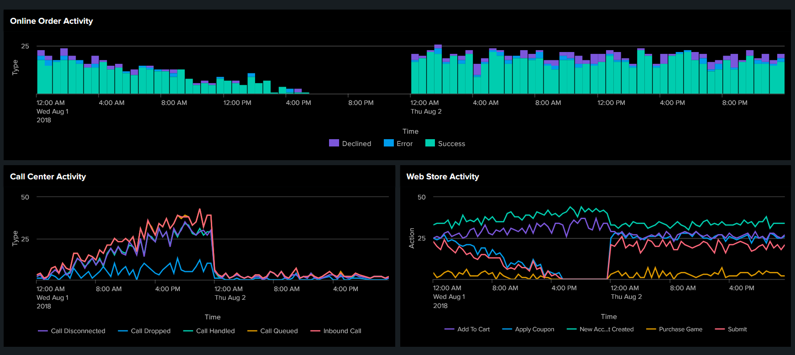

### Interpreting the story this dashboard tells us

In the web store activity, We can see that new account creation and adding products to the cart is fairly constant throughout the day. However, Starting at around 12:00 AM UTC on August 1st, There is a steady decline in purchases, coupon usage, and submissions. This aligns closely with observations from the online order activity panel.

It is also apparent that the call center activity is inversely proportional to the decline in purchases in the web store activity panel. This could be interpreted as certain aspects of the web API becoming slower over time to the point that they are no longer usable, resulting in a surge in frustrated customers reaching out & possibly indicating that the web server is experiencing a memory leak or a cyberattack.

Moreover, The sudden surge in purchase activity on 12:00 AM UTC on August 2nd could indicate the problem being resolved by an automated restart of the web server by stopping a memory leak and/or loading fixes for the backend.

### Benefits of a SIEM dashboard within cybersecurity contexts

As a side note, Dashboards created in a pure cybersecurity context can allow an analyst to identify trends associated with a cyberattack that might otherwise have been missed by current automated alerting. In addition, the structure of any trends identified could then be used to inspire the design of more sophisticated alert/rule criteria and signatures, with the potential to drastically improve detection rates and analyst response times & efficiency.

---

## 3 - Wazuh - Data Aggregation, Alert Triggering & Monitoring, Custom Rules

### The Plan
1. Host a Wazuh web server on an Amazon Linux 2023 VM
2. Set up a Wazuh agent on a Ubuntu Linux VM
3. Aggregate useful logs from Ubuntu to Wazuh
4. Trigger security alerts through various means
5. Set up and validate new rules, Modify existing rules

In previous projects, I set up the 2 VMs necessary for this project, Ubuntu already has a Wazuh agent installed. That just leaves aggregating data and triggering alerts.

### Aggregating Logs

#### What kind of logs are available?
The most straightforward way of answering this question is to search for all files with the `.log` file extension on the ubuntu VM.

`sudo find / -iname "*.log"`

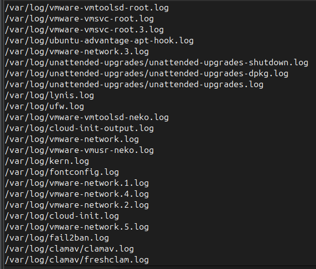

The output from this command indicates that the majority of logs stored on the system are, unsurprisingly, stored in /var/log.

Of the logs found, I selected the following for further analysis, prioritized primarily by ease of controlled testing & ability to create proof-of-concepts:

| Log File   | Source(s)       | Events of Interest                                                                  |
| ---------- | --------------- | ----------------------------------------------------------------------------------- |
| auth.log   | Various         | Authentication failure                                                              |
| clamav.log | Clam Antivirus  | Mock virus detections, Changing/disabling AV                                        |
| kern.log   | Kernel, Various | Hardware Events (Plug in USB, etc), Also includes ufw.log blocked inbound requests, |

#### How do I get the logs into Wazuh?

According to the [Wazuh documentation site](https://documentation.wazuh.com/4.14/user-manual/capabilities/log-data-collection/monitoring-log-files.html), the `/var/ossec/etc/ossec.conf` file can be used to configure which logs are ingested into Wazuh.

In the contents of that file, we can see a couple log files configured to be ingested.

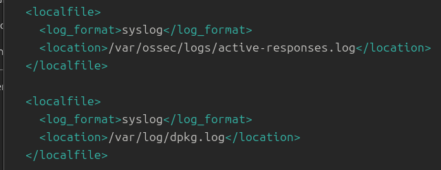

These are the same log files visible in the Wazuh WebUI.

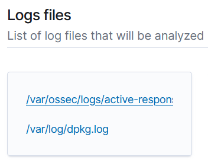

I'll create and save some new entries for auth.log, clamav.log, and kern.log:

Now, I assume the wazuh daemon needs to be restarted:

`systemctl restart wazuh-agent`

Let's refresh the WebUI to see if the new log files are included:

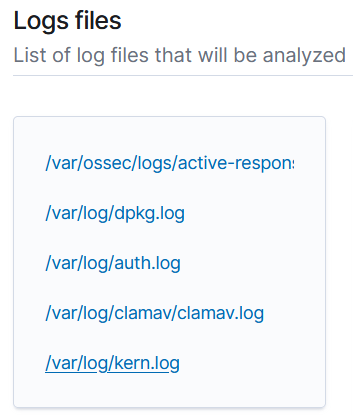

Excellent. It looks like the new log files have been registered with wazuh!

### Examining Current Detection

Wazuh seems to have a substantial number of pre-built rules out-of-the-box, with some relevant to authentication failures & sudo.

I'll attempt to trigger an alert by entering the wrong password into a bash shell multiple times:

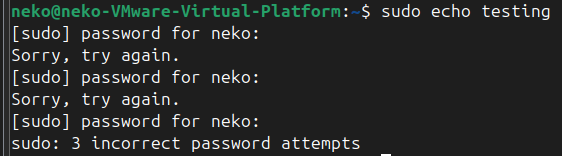

Now to check Wazuh's alerts:

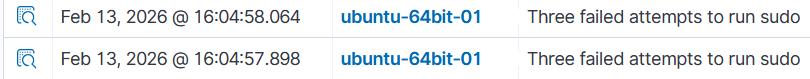

It looks like there's already a rule for this! But there's a duplicate alert. What's going on here?

One of the alerts originates from `/var/log/auth.log`, and another originates from a location called `journald`. Here's how I interpret this:
- The `auth.log` file was successfully ingested into Wazuh.
- Ingesting the file was unnecessary, as the log data is already present in journald.
- No log files or directories named journald could be found on Ubuntu. However, A daemon called systemd-journald is currently running.

According to some online research, systemd-journald is a daemon responsible for centralizing log data. - Instead of entering log files into `ossec.conf`, It would be a better idea to use a journald-related workflow to help avoid aggregating duplicate log data.

### Backtracking & Change of Plans - Centralizing Log Data in journald

I removed the clamav.log, auth.log, and kern.log entries from `ossec.conf` and restarted the wazuh agent. I tried triggering the alert again, and this time there was no duplicate, with the only remaining alert originating from journald.

Next, I need to figure out which log data of interest is already present in journald to avoid aggregating duplicate log data. - I'll achieve this by finding the "syslog identifiers" present in the logs of interest and using them to cross-reference duplicate log entries in journald.

The `journalctl` bash command displays the contents of the journald logs. By specifying a SYSLOG_IDENTIFIER option, you can display a more-relevant subset of the logs. This will be useful in the cross-referencing process.

During cross-referencing, I made several discoveries about ClamAV:
- Scanning using the `clamscan` command outputs to `stdout` **only**; not `/var/log/clamav/clamav.log`, and does not use the syslog format or syslog identifiers.
- Scanning using the `clamdscan` command, however, does output to `/var/log/clamav/clamav.log` not using the syslog format. However, `clamdscan` scans **do** output in syslog format to `/var/log/syslog` and `journald`.

Cross-referencing proceeded as follows:
- auth.log's "3 incorrect password attempts" entry uses the syslog identifier "sudo"
- Using `journalctl -r SYSLOG_IDENTIFIER=sudo` to display entries in reverse order using the sudo syslog identifier indicates "3 incorrect password attempts" entries are also present in journald. This is already known, since we saw duplicate alerts for this earlier.
- kern.log uses syslog identifier "kernel" for various entries. These can also be found in journald.
- Performing ClamAV scans using the `clamdscan` command outputs in syslog format to both `/var/log/syslog` and journald with syslog identifier "clamd".

| File     | Entry                         | Syslog Identifier | Duplicate? |
| -------- | ----------------------------- | ----------------- | ---------- |
| auth.log | 3 incorrect password attempts | sudo              | Yes        |
| kern.log | various                       | kernel            | Yes        |
| syslog   | ClamAV signature found        | clamd             | Yes        |

Based on these findings, All log data of interest is already present in journald, and further data aggregation will **not** be necessary for this project.

### Examining Current Detection, Creating Custom Rules (Continued)
So far, I have been able to trigger a sudo authentication alert. Continuing, I would like to create and trigger antivirus-related alerts.

To start off, I will stop the clamav daemon and examine relevant logs to see if its shutdown recorded anywhere.

`sudo systemctl stop clamav-daemon`

`journalctl -n 25 -f | grep clam`

`neko-VMware-Virtual-Platform systemd[1]: clamav-daemon.service: Deactivated successfully.`

In the above journald log entry, we can see that daemon deactivation is logged using the systemd syslog identifier. It doesn't look like this log entry triggers an alert in Wazuh, so I'll have to make a brand new alert for it.

### Custom Rule - ClamAV Daemon Monitor

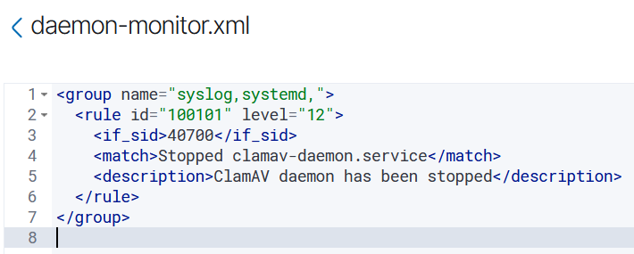

According to Wazuh's documentation, user-defined rules should have IDs between `100000` and `120000`.

`<if_sid>` only processes this rule if the specified rule has been triggered first. Therefore, this rule is effectively a child rule of rule 40700 (systemd/systemctl).

`<match>` is a plain string to match against. Only the log message itself is necessary because Wazuh strips timestamps, hostnames, & programs from syslog entries.

Theoretically, stopping clamav-daemon should now trigger the new high-severity alert.

Stop clamav-daemon

`sudo systemctl stop clamav-daemon`

Check journald for relevant log entries

`journalctl -n 150 -f SYSLOG_IDENTIFIER=systemd`

The daemon has been stopped, and a relevant log entry has been recorded in journald. Now, I'll check the Wazuh WebUI for new alerts.

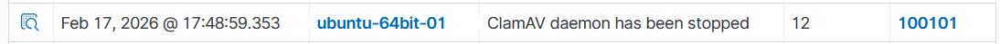

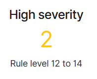

Sure enough, a high-severity alert has been emitted! The custom rule is functional as a proof-of-concept, but could use more work before it would be appropriate for real-world use.

### Modify Existing Rule - Sudo Authentication Failure
Pre-built rules are stored on the VM hosting Wazuh at the directory `/var/ossec/ruleset/rules`. Currently, rule 5404 (3 incorrect password attempts for sudo) is set at severity level 10, but I would like to change it to severity level 12 so it counts as high-severity.

According to the Wazuh WebUI, Rule 5404 is stored in a file named `0020-syslog_rules.xml`. I opened a shell with elevated permissions, navigated to the rules directory, and edited the contents of the file to change the rule's level to 12.

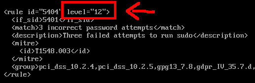

After restarting the Wazuh VM and checking the alert severity in the WebUI, We can now see that the alert's severity is 12. The modification seems to have been successful.

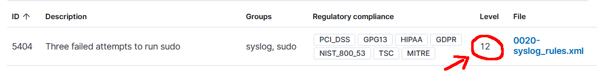

Furthermore, After triggering the alert, We can now see the alert is of a high severity level.

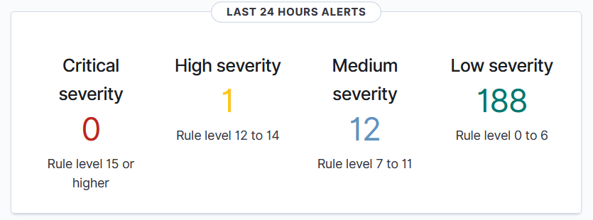

### Modify Existing Rule - ClamAV Virus Detections
Initially, I planned to create a custom rule for ClamAV virus detections, as I was previously unable to find a prebuilt rule. However, I was later able to find one! - Rule `52502` in `0320-clam_av_rules.xml`.

Repeating the previous process, I changed the severity level from 8 (medium) to 12 (high).

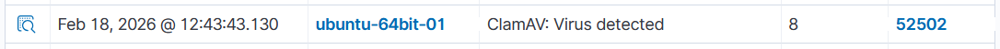

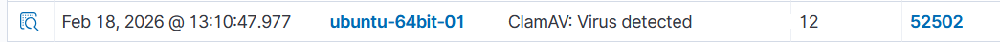

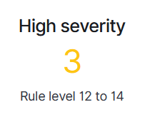

---

## 4 - Conclusion
### Splunk Cloud - Querying, Data Visualization, Dashboards, & Data Analysis
A mock dataset was imported into Splunk Cloud and was queried to create a dashboard comprised of data visualization panels. My interpretation of the data visualizations strongly indicated that business operations were being strained and interrupted by technical problems on the backend or a potential malicious act, and were resolved by a regularly scheduled restart.

### Wazuh - Data Aggregation, Alert Triggering, Modified or Custom Rules
An understanding of aggregating data from Ubuntu to Wazuh was demonstrated, but was ultimately unnecessary due to the log data of interest already being present in journald.
Nevertheless, the log data was used in conjunction with modified pre-existing rules and brand-new custom rules to improve security posture and response times by drawing attention to potential high-priority security threats.